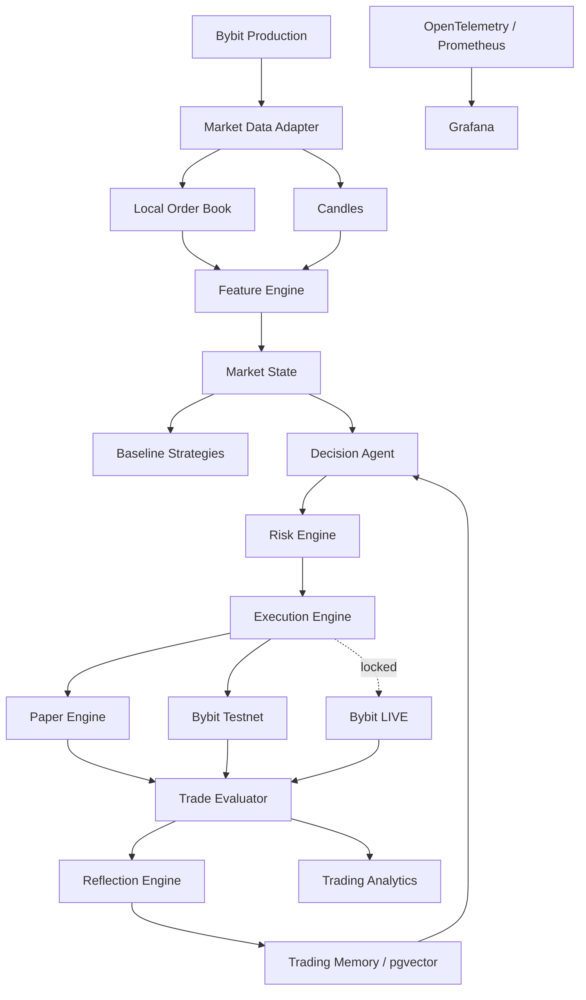

# Product Requirements Document
## Self-Evaluating Trading Agent — ETH/USDT

**Versión:** 1.0  
**Fecha:** 2026-08-21  
**Estado:** Ready for Development  
**Entorno inicial:** Local / Linux / WSL2  
**Exchange inicial:** Bybit  
**Mercado:** Spot  
**Instrumento operable:** ETH/USDT  
**Instrumento contextual:** BTC/USDT  
**Agente de desarrollo:** OpenCode  

---

# 1. Resumen ejecutivo

Se desarrollará una aplicación denominada **Self-Evaluating Trading Agent**, cuyo propósito será analizar de manera continua el mercado de `ETH/USDT`, generar decisiones estructuradas de trading mediante un LLM, someter dichas decisiones a un motor determinista de riesgo, ejecutar operaciones simuladas y, eventualmente, operaciones reales controladas, evaluar los resultados obtenidos y utilizar esas experiencias como memoria para decisiones futuras.

El sistema deberá funcionar inicialmente de forma **100% local**.

No se realizará despliegue en nube hasta que la versión local haya sido completamente implementada, probada, documentada y aprobada por el usuario.

El proyecto persigue dos objetivos paralelos:

1. Construir una herramienta de trading que pueda demostrar estadísticamente si posee una ventaja económica real.
2. Servir como proyecto práctico del roadmap de **Ingeniería de Software 2.0**, incluyendo arquitectura, APIs, bases de datos, testing, Git, CI/CD, contenedores, observabilidad, ML, RAG y desarrollo agéntico.

El proyecto **no asumirá que un LLM produce rentabilidad**.

La rentabilidad será una hipótesis que deberá ser demostrada experimentalmente.

---

# 2. Hipótesis del producto

La hipótesis principal es:

> Un agente LLM que recibe market state estructurado, contexto multi-timeframe, experiencias históricas similares y retroalimentación de sus decisiones puede producir mejores decisiones de trading que estrategias deterministas y modelos ML sencillos.

La hipótesis se considerará falsa si los experimentos demuestran que:

- no supera los baselines;
- su mejora no es estadísticamente estable;
- su ventaja desaparece al incluir fees/slippage;
- el costo del LLM elimina el beneficio;
- presenta drawdowns inaceptables;
- solo funciona en determinados períodos históricos;
- existe evidencia significativa de overfitting.

El sistema deberá estar preparado para concluir:

> **El LLM no aporta valor.**

Ese resultado también se considera técnicamente válido.

---

# 3. Objetivos

## 3.1 Objetivos funcionales

El sistema deberá:

- consumir datos reales de producción de Bybit;
- analizar `ETH/USDT`;
- consumir `BTC/USDT` exclusivamente como contexto;
- construir market state multi-timeframe;
- calcular indicadores y features;
- clasificar regímenes de mercado;
- generar decisiones `BUY / SELL / HOLD`;
- utilizar un LLM como decisor supervisado;
- gestionar memoria mediante PostgreSQL + pgvector;
- recuperar experiencias históricas similares;
- evaluar automáticamente trades anteriores;
- generar reflexiones estructuradas;
- proponer mejoras de estrategia;
- impedir que dichas mejoras se apliquen automáticamente;
- disponer de Risk Engine determinista;
- ejecutar backtesting;
- ejecutar market replay;
- ejecutar paper trading sobre datos reales de producción;
- conectarse posteriormente a Bybit Testnet;
- disponer técnicamente de integración LIVE;
- mantener LIVE deshabilitado por defecto;
- proporcionar dashboard operativo;
- proporcionar observabilidad técnica;
- proporcionar analítica cuantitativa del trading;
- comparar distintas estrategias y modelos.

---

# 4. No objetivos de la primera versión

Quedan fuera inicialmente:

- noticias;
- Twitter/X;
- Reddit;
- sentimiento social;
- Fear & Greed Index;
- análisis macroeconómico;
- funding rates;
- open interest;
- liquidaciones;
- futuros/perpetuos;
- apalancamiento;
- shorts;
- múltiples criptomonedas operables;
- múltiples exchanges;
- microservicios;
- Kafka;
- RabbitMQ;
- Redis;
- Celery;
- Kubernetes;
- LangChain;
- LangGraph;
- despliegue cloud.

La arquitectura deberá permitir incorporar algunas de estas capacidades posteriormente sin reescribir el dominio.

---

# 5. Mercado inicial

## 5.1 Instrumento operable

```text
ETH/USDT
```

Mercado:

```text
SPOT
```

Modalidad:

```text
LONG ONLY
```

Capital virtual inicial:

```text
1,000 USDT
```

---

## 5.2 Semántica de acciones

### BUY

Compra ETH utilizando USDT disponible.

### SELL

Solo puede:

- reducir una posición existente;
- cerrar completamente una posición existente.

Nunca podrá vender ETH que el portfolio no posea.

### HOLD

No modifica la posición.

---

# 6. Contexto BTC

`BTC/USDT` será consumido como variable contextual de solo lectura.

Nunca podrá generarse una orden sobre BTC.

El contexto podrá incluir:

- precio;
- retornos;
- tendencia;
- volumen;
- volatilidad;
- momentum;
- features de order book;
- régimen de mercado.

---

# 7. Timeframes

La estrategia será multi-timeframe.

| Timeframe | Uso |
|---|---|
| 15m | Decisiones |
| 1h | Contexto intermedio |
| 4h | Tendencia/régimen principal |

En la primera versión, el ciclo del agente se ejecutará únicamente:

```text
al cierre confirmado de cada vela de 15 minutos
```

En una fase posterior podrán incorporarse triggers extraordinarios.

Ejemplos:

- volatilidad extrema;
- ruptura;
- incremento anormal de volumen;
- cambios fuertes de order-book imbalance;
- movimientos anormales de BTC.

Estos triggers solo serán aceptados si demuestran mejora frente al baseline.

---

# 8. Arquitectura

Se utilizará inicialmente un **monolito modular**.

No deberán crearse microservicios sin evidencia técnica que justifique la separación.

Arquitectura lógica:



---

# 9. Arquitectura de software

Se utilizará un enfoque **Hexagonal / Ports & Adapters pragmático**.

No deberán crearse capas sin responsabilidad real.

Estructura inicial propuesta:

```text
src/
├── domain/
│   ├── market/
│   ├── trading/
│   ├── portfolio/
│   ├── risk/
│   ├── evaluation/
│   ├── memory/
│   └── experiments/
│
├── application/
│   ├── services/
│   ├── commands/
│   ├── queries/
│   └── ports/
│
├── infrastructure/
│   ├── bybit/
│   ├── database/
│   ├── llm/
│   ├── embeddings/
│   ├── observability/
│   └── execution/
│
├── interfaces/
│   ├── api/
│   ├── web/
│   └── cli/
│
└── main.py
```

---

# 10. Stack tecnológico

## Backend

- Python
- FastAPI
- Pydantic v2
- SQLAlchemy 2.x
- Alembic
- PostgreSQL
- pgvector
- asyncio

## Gestión Python

```text
uv
```

`uv.lock` deberá quedar versionado.

---

## Frontend

Inicialmente:

- Jinja2
- HTMX
- HTML/CSS

No se utilizará React inicialmente.

La API deberá permanecer desacoplada para permitir cambiar la interfaz posteriormente.

---

## Contenedores

Docker y Docker Compose deberán utilizarse en la medida de lo razonable.

Servicios previstos:

```text
application
postgres + pgvector
prometheus
grafana
```

No deberán introducirse contenedores sin necesidad demostrada.

---

# 11. Gestión obligatoria de dependencias

OpenCode **NO podrá instalar software o dependencias automáticamente**.

Esto incluye:

- paquetes Python;
- herramientas CLI;
- imágenes Docker nuevas;
- extensiones;
- MCPs;
- software del sistema;
- frameworks;
- servicios adicionales.

Antes de instalar algo, deberá generar:

```text
Dependency Proposal
```

incluyendo:

- nombre;
- versión propuesta;
- problema que resuelve;
- por qué es necesario;
- alternativas;
- razón para no implementarlo internamente;
- impacto en arquitectura;
- seguridad;
- licencia cuando sea relevante;
- comandos necesarios;
- rollback.

OpenCode deberá solicitar autorización.

Solo después de autorización podrá ejecutarse la instalación.

Las dependencias de una fase podrán proponerse agrupadas.

---

# 12. Memoria del proyecto para OpenCode

La memoria del **desarrollo** será administrada mediante:

```text
DeusData/codebase-memory-mcp
```

Esta memoria es diferente de la memoria del Trading Agent.

## Reglas

Antes de modificar arquitectura o componentes existentes, OpenCode deberá consultar la memoria del codebase.

En cada fase:

```text
Index
  ↓
Understand
  ↓
Impact Analysis
  ↓
Implement
  ↓
Re-index
  ↓
Verify
```

El agente deberá usarla para:

- comprender módulos existentes;
- localizar dependencias;
- realizar impact analysis;
- evitar implementaciones duplicadas;
- conservar decisiones arquitectónicas;
- analizar call graphs;
- preparar refactors.

La instalación de `codebase-memory-mcp` también está sujeta a la política de autorización de instalaciones.

---

# 13. Market Data

## 13.1 Fuente

Bybit Production.

Nunca deberá utilizarse Testnet como fuente principal para evaluar la estrategia.

---

## 13.2 Candles

Se consumirán:

```text
ETHUSDT
BTCUSDT
```

Timeframes:

```text
15m
1h
4h
```

Solo una vela confirmada podrá disparar una decisión.

---

# 14. Order Book

Se mantendrá un order book local mediante WebSocket.

No se almacenará permanentemente cada actualización bruta.

Se persistirán features agregadas.

Ejemplos:

- best bid;
- best ask;
- spread;
- spread porcentual;
- bid depth;
- ask depth;
- imbalance;
- profundidad por bandas;
- cambios de liquidez;
- presión compradora;
- presión vendedora.

Ante pérdida de sincronización:

```text
Market State = STALE
```

No podrán abrirse nuevas posiciones.

El sistema deberá:

1. reconectarse;
2. solicitar/reconstruir snapshot;
3. reconciliar secuencia;
4. verificar integridad;
5. marcar datos como saludables;
6. reactivar decisiones.

---

# 15. Feature Engine

Features iniciales:

- OHLCV;
- returns;
- RSI;
- MACD;
- EMA;
- ATR;
- VWAP;
- volumen relativo;
- realized volatility;
- momentum;
- bid/ask spread;
- order book imbalance;
- profundidad;
- tendencia 15m;
- tendencia 1h;
- tendencia 4h;
- contexto BTC.

Los indicadores básicos deberán implementarse internamente siempre que sea razonable.

No introducir TA-Lib u otra dependencia de indicadores sin justificarla.

---

# 16. Market Regime

El sistema deberá clasificar el estado de mercado.

Estados iniciales:

```text
TREND_UP
TREND_DOWN
SIDEWAYS
HIGH_VOLATILITY
LOW_VOLATILITY
BREAKOUT
```

La primera implementación será determinista y versionada.

Posteriormente podrá evaluarse otro clasificador.

---

# 17. LLM Provider

El dominio deberá ser completamente independiente del proveedor.

Contrato conceptual:

```python
class LLMProvider(Protocol):
    async def decide(
        self,
        market_state: MarketState,
        memories: list[TradingMemory],
        context: DecisionContext,
    ) -> TradingDecision:
        ...
```

Adapters previstos:

```text
DeepSeekProvider
OpenAIProvider
OllamaProvider
```

---

# 18. Proveedor inicial

Primera implementación:

```text
DeepSeek
```

Modelo inicial recomendado:

```text
deepseek-v4-flash
```

`deepseek-v4-pro` podrá utilizarse posteriormente como comparador.

OpenAI será el segundo provider.

Ollama será opcional posteriormente.

Cambiar el modelo de una estrategia promovida requiere autorización humana.

---

# 19. Contrato del Decision Agent

El LLM no devolverá texto libre como contrato principal.

Debe producir una estructura equivalente a:

```json
{
  "decision": "BUY",
  "confidence": 0.73,
  "intensity": "MEDIUM",
  "rationale_summary": "Momentum positivo con confirmación de volumen.",
  "supporting_factors": [
    "MACD_BULLISH",
    "RELATIVE_VOLUME_HIGH"
  ],
  "risk_factors": [
    "BTC_WEAK"
  ]
}
```

Valores válidos:

```text
decision:
BUY
SELL
HOLD
```

```text
intensity:
LOW
MEDIUM
HIGH
```

El LLM **NO puede especificar cantidades monetarias**.

---

# 20. Fail-safe del LLM

Ante cualquiera de las siguientes condiciones:

- timeout;
- API caída;
- presupuesto agotado;
- JSON inválido;
- schema inválido;
- confidence fuera de rango;
- respuesta incompleta;
- modelo no disponible;

la acción será:

```text
HOLD
```

Nunca se reutilizará automáticamente la última decisión.

Nunca se intentará interpretar creativamente una respuesta inválida.

---

# 21. Gestión del tamaño de posición

El sizing será híbrido.

El LLM produce:

```text
LOW
MEDIUM
HIGH
```

El Risk Engine determina el monto real.

Ejemplo conceptual:

```text
LLM Intensity
      ↓
Risk Budget
      +
ATR
      +
Stop Distance
      +
Capital
      +
Drawdown
      ↓
Position Size
```

El Risk Engine posee autoridad absoluta.

---

# 22. Risk Engine

Configuración inicial:

```text
capital = 1000 USDT

max_position_allocation = 2%
max_daily_loss = 2%
max_drawdown = 5%

max_open_positions = 1
leverage = 0
stop_loss_required = true
```

Todos los valores deberán ser parametrizables y versionados.

El LLM no podrá modificarlos.

---

# 23. Stop Loss y Take Profit

Se utilizarán reglas deterministas basadas principalmente en:

```text
ATR
+
volatilidad
```

Se permitirán:

- stop loss;
- take profit;
- trailing stop;
- tiempo máximo en posición.

Los parámetros deberán permanecer dentro de límites configurados.

---

# 24. Salida híbrida

El LLM puede solicitar:

```text
SELL
```

antes de que se alcance un objetivo.

Sin embargo:

```text
STOP LOSS
TAKE PROFIT
TRAILING STOP
MAX DRAWDOWN
KILL SWITCH
```

tienen prioridad absoluta.

---

# 25. Paper Trading Engine

El Paper Engine deberá utilizar:

```text
Market Data real de Bybit Production
```

pero simular localmente:

- órdenes;
- fills;
- fees;
- slippage;
- balances;
- posiciones;
- PnL.

El simulador deberá ser determinista cuando opere sobre datos históricos congelados.

---

# 26. Bybit Testnet

Testnet no se utilizará para medir rentabilidad.

Se utilizará para validar:

- autenticación;
- creación de órdenes;
- cancelación;
- fills;
- errores;
- lifecycle;
- reconexión;
- rate limiting;
- reconciliación;
- manejo de estados.

---

# 27. Fees

Las métricas oficiales deberán utilizar fees reales/configurables de Bybit.

Nunca deberá evaluarse una estrategia únicamente con PnL bruto.

---

# 28. Slippage

Cuando exista order book:

```text
slippage =
f(
    spread,
    order_size,
    depth
)
```

Para históricos sin order book se utilizará un modelo conservador parametrizado.

Toda comparación deberá mostrar:

```text
Gross PnL
Net PnL
Fees
Slippage
LLM Cost
Fully Loaded PnL
```

---

# 29. Baseline determinista

Antes de evaluar al agente se implementará una estrategia sencilla basada en reglas.

Ejemplo de señales:

- EMA;
- RSI;
- MACD;
- tendencia;
- ATR;
- volumen.

La estrategia deberá ser explícita, reproducible y versionada.

Su propósito no es ser sofisticada.

Su propósito es actuar como referencia.

---

# 30. Baseline ML

Se implementará inicialmente un modelo sencillo:

```text
Logistic Regression
```

utilizando un pipeline reproducible.

Posteriormente podrá incorporarse un baseline no lineal si aporta valor experimental.

El ML nunca podrá utilizar información futura.

---

# 31. Experimentos obligatorios

El sistema deberá permitir comparar:

```text
Buy & Hold
        vs
Baseline determinista
        vs
Baseline ML
        vs
LLM sin memoria
        vs
LLM + Trading Memory
        vs
LLM + Memory + mejora aprobada
```

---

# 32. Trading Memory

La memoria operativa del agente utilizará:

```text
PostgreSQL
+
pgvector
```

Se almacenarán:

- decisión;
- market state;
- features;
- régimen;
- confidence;
- acción;
- posición;
- resultado;
- PnL;
- MFE;
- MAE;
- fees;
- slippage;
- reflexión;
- embedding;
- versión de estrategia;
- versión de prompt;
- modelo;
- experimento.

---

# 33. Embedding Provider

Contrato independiente:

```text
EmbeddingProvider
```

Implementación inicial:

```text
local
```

Modelo recomendado:

```text
intfloat/multilingual-e5-small
```

Provider futuro:

```text
OpenAI embeddings
```

Cada espacio de embeddings deberá estar versionado.

Cambiar el embedding model requerirá reindexar la memoria correspondiente.

---

# 34. Prevención obligatoria de data leakage

Esta es una restricción crítica.

Una decisión generada en:

```text
T
```

solo podrá recuperar memoria cuyo conocimiento estuviera disponible antes de `T`.

Por lo tanto:

```text
memory.outcome_timestamp < decision_timestamp
```

debe cumplirse.

Una reflexión solo entra en memoria cuando el trade correspondiente ha terminado.

Los tests deberán comprobar automáticamente que ninguna información futura entra al contexto.

---

# 35. Reflection Engine

Después de finalizar un trade:

```text
State
 ↓
Decision
 ↓
Execution
 ↓
Outcome
 ↓
Reflection
```

Se generará una reflexión estructurada.

Ejemplo:

```json
{
  "result": "LOSS",
  "primary_error": "COUNTER_TREND_ENTRY",
  "lesson": "La señal de momentum fue prematura frente a la tendencia 4h.",
  "future_condition": "Reducir confianza cuando 15m contradiga fuertemente 4h."
}
```

La reflexión no modificará automáticamente estrategia o riesgo.

---

# 36. Improvement Engine

Periódicamente podrá analizar trades históricos y proponer mejoras.

Flujo:

```text
Historical Results
       ↓
Pattern Analysis
       ↓
Improvement Proposal
       ↓
Backtest
       ↓
Walk Forward
       ↓
Comparison
       ↓
Human Approval
       ↓
New Strategy Version
```

Nunca:

```text
Reflection
    ↓
Auto-change production strategy
```

---

# 37. Versionado de prompts

Los prompts deberán almacenarse como archivos versionados.

Ejemplo:

```text
prompts/
├── decision/
│   ├── v001.md
│   └── v002.md
└── reflection/
    ├── v001.md
    └── v002.md
```

Una modificación de prompt:

- crea nueva versión;
- genera nuevo experimento;
- no sobrescribe versiones anteriores.

---

# 38. Reproducibilidad del LLM

Debido a que los proveedores pueden actualizar modelos detrás de un alias, cada ejecución deberá almacenar:

```text
provider
requested_model
reported_model_version
request
response
prompt_hash
market_state_hash
temperature
parameters
timestamp
latency
input_tokens
output_tokens
cost
```

Cuando sea posible, decisiones de experimentos cerrados deberán cachearse para permitir replay sin volver a consultar al proveedor.

---

# 39. Experiment Tracking

Cada experimento tendrá un identificador inmutable.

Campos mínimos:

```text
experiment_id
git_commit
dataset_version
strategy_version
prompt_version
llm_provider
llm_model
embedding_provider
embedding_model
risk_config_version
feature_config_version
fees_model_version
slippage_model_version
random_seed
started_at
finished_at
```

---

# 40. Datos históricos

Se descargará un mínimo de:

```text
36 meses
```

de histórico de Bybit.

No deberán subirse datasets grandes directamente al repositorio Git.

Se almacenarán:

```text
datasets/
```

fuera del versionado normal.

Git deberá contener:

```text
dataset manifest
source
date range
symbols
timeframes
row counts
SHA-256
download command
schema version
```

El dataset oficial deberá poder reconstruirse.

---

# 41. Dataset congelado

Cada benchmark oficial utilizará una versión inmutable del dataset.

Ejemplo:

```text
dataset_version:
BYBIT_ETHBTC_V001
```

El hash deberá ser verificado antes del experimento.

---

# 42. Separación temporal

El período final deberá permanecer bloqueado.

Recomendación inicial:

```text
36+ meses

Development / Walk Forward:
~30 meses

Final Holdout:
últimos ~6 meses
```

La separación exacta quedará congelada antes de iniciar optimización.

---

# 43. Walk-forward Validation

Se utilizarán ventanas temporales sucesivas.

Ejemplo:

```text
Train
 ↓
Validation
 ↓
Forward Test

        Train
          ↓
      Validation
          ↓
      Forward Test
```

Nunca se realizará `shuffle` temporal.

---

# 44. Final Holdout

El holdout:

- no puede utilizarse para ajustar indicadores;
- no puede utilizarse para ajustar prompts;
- no entra al RAG;
- no puede utilizarse para seleccionar modelos;
- no puede utilizarse para elegir parámetros.

Solo podrá abrirse cuando la estrategia candidata se declare:

```text
FROZEN
```

---

# 45. Métricas de trading

Mínimas:

```text
Gross PnL
Net PnL
Fully Loaded PnL
Win Rate
Loss Rate
Profit Factor
Sharpe
Sortino
Max Drawdown
Expectancy
Average Winner
Average Loser
Risk/Reward
Fees
Slippage
LLM Cost
Trades
Holding Time
Exposure
```

---

# 46. Métricas específicas del agente

También deberán medirse:

```text
BUY count
SELL count
HOLD count

confidence distribution
confidence calibration

confidence vs outcome

memory hits
memory similarity

decision latency

LLM failures

invalid outputs

cost per decision

cost per executed trade

cost per profitable trade
```

---

# 47. Gate estadístico para LIVE

Una estrategia candidata deberá cumplir **TODAS** las condiciones siguientes.

## Performance

```text
Net PnL > 0
Profit Factor >= 1.30
Sharpe >= 1.20
Sortino >= 1.50
Max Drawdown <= 8%
Expectancy > 0
```

Mínimo:

```text
200 trades
```

---

## Robustez

Deberá:

- funcionar positivamente en al menos dos regímenes;
- superar baseline determinista;
- superar baseline ML;
- compararse con Buy & Hold;
- permanecer rentable después de fees;
- permanecer rentable después de slippage;
- evaluar costos del LLM.

---

## Análisis estadístico

Obligatorio:

- confidence intervals;
- bootstrap;
- Monte Carlo sobre secuencia de trades;
- estabilidad por ventanas;
- sensibilidad a fees;
- sensibilidad a slippage;
- sensibilidad a parámetros;
- análisis de overfitting;
- degradación train → validation → holdout.

Una estrategia cuyo resultado dependa de un conjunto extremadamente estrecho de parámetros deberá rechazarse.

---

# 48. Paper Trading Certification

Antes de considerar LIVE:

```text
>= 30 días calendario
AND
>= 200 trades
AND
>= 2 market regimes
```

Si después de 30 días no existen 200 trades:

```text
el período se extiende
```

Nunca deberán generarse trades artificialmente para alcanzar el mínimo.

---

# 49. LIVE

La aplicación tendrá capacidad técnica de LIVE, pero:

```text
LIVE = DISABLED BY DEFAULT
```

No forma parte de la aceptación funcional inicial tener dinero real operando.

---

# 50. LIVE Readiness

Para habilitarlo deberán existir simultáneamente:

```text
TRADING_MODE=LIVE

LIVE_TRADING_ENABLED=true

LIVE_READINESS_GATE=PASSED

USER_APPROVAL=VALID
```

Además:

- aprobación humana almacenada;
- confirmación interactiva;
- capital máximo de sesión;
- kill switch;
- credenciales productivas;
- auditoría.

Después de reiniciar:

```text
LIVE => DISABLED
```

El usuario deberá reactivarlo deliberadamente.

El agente nunca podrá habilitar LIVE.

---

# 51. Kill Switch

Debe existir en:

- dominio;
- API;
- CLI;
- dashboard.

Al activarse:

```text
NEW ORDERS = BLOCKED
```

El evento debe quedar auditado.

La recuperación requiere intervención humana.

---

# 52. Dashboard

Tecnologías:

```text
FastAPI
Jinja2
HTMX
```

Debe mostrar:

- estado del sistema;
- conexión Bybit;
- precio ETH;
- precio BTC;
- estado del order book;
- mercado stale/healthy;
- estrategia activa;
- modelo LLM;
- market regime;
- decisión actual;
- confidence;
- intensidad;
- posición;
- PnL;
- drawdown;
- trades;
- decisiones rechazadas;
- Risk Engine;
- reflexiones;
- costos LLM;
- métricas;
- experimentos;
- LIVE readiness;
- kill switch.

La actualización inicial podrá utilizar HTMX polling.

---

# 53. Seguridad del dashboard

Por defecto:

```text
bind = localhost
```

Rol inicial:

```text
operator
```

Acciones sensibles requerirán confirmación adicional.

Ejemplos:

- cambiar modo;
- modificar riesgo;
- cambiar modelo;
- promover estrategia;
- resetear kill switch;
- preparar LIVE.

Todas generarán:

```text
audit_event
```

---

# 54. API inicial

Propuesta:

```text
GET  /health
GET  /ready

GET  /api/v1/system/state

GET  /api/v1/market/eth
GET  /api/v1/market/btc

GET  /api/v1/decisions
GET  /api/v1/trades
GET  /api/v1/positions

GET  /api/v1/analytics/performance

GET  /api/v1/experiments
GET  /api/v1/experiments/{id}

GET  /api/v1/live/readiness

POST /api/v1/kill-switch
POST /api/v1/trading/mode
```

Endpoints administrativos deberán estar protegidos.

---

# 55. PostgreSQL — entidades principales

Modelo conceptual:

```text
market_candles
market_feature_snapshots
orderbook_feature_windows

market_regimes

decisions
risk_evaluations

orders
fills
positions
trades
trade_outcomes

reflections
memory_items

strategies
strategy_versions

prompts
prompt_versions

experiments
experiment_runs

llm_calls
llm_costs

risk_configs

dataset_manifests

system_state

approvals
audit_events
```

---

# 56. Migraciones

Se utilizará:

```text
Alembic
```

Nunca deberán modificarse manualmente esquemas productivos como mecanismo normal.

Toda modificación:

```text
migration
+
upgrade test
+
downgrade test
```

---

# 57. ORM

Se utilizará:

```text
SQLAlchemy 2.x
```

SQL explícito podrá utilizarse para consultas complejas cuando sea más claro o eficiente.

No deberá forzarse el ORM cuando perjudique legibilidad.

---

# 58. Configuración

Propuesta:

```text
config/
├── base.yaml
├── backtest.yaml
├── replay.yaml
├── paper.yaml
└── live.yaml
```

Secrets:

```text
.env
```

`.env` nunca se versionará.

Se entregará:

```text
.env.example
```

sin credenciales.

---

# 59. Secrets

Posibles secretos:

```text
DEEPSEEK_API_KEY
OPENAI_API_KEY
BYBIT_API_KEY
BYBIT_API_SECRET
```

En GitHub:

```text
GitHub Actions Secrets
```

Si posteriormente existe cloud, deberá evaluarse Secret Manager.

---

# 60. Budget Control del LLM

Existirán dos presupuestos:

```text
experiment_budget
monthly_budget
```

Alertas:

```text
50%
75%
90%
```

Al alcanzar:

```text
100%
```

se bloquearán nuevas llamadas del experimento/agente correspondiente.

En Paper/LIVE:

```text
LLM unavailable => HOLD
```

---

# 61. Observabilidad

Stack:

```text
OpenTelemetry
Prometheus
Grafana
```

No se incorporará Loki inicialmente.

Logs:

```text
structured JSON
```

---

# 62. Métricas técnicas

Como mínimo:

- API latency;
- request count;
- error rate;
- Bybit WebSocket status;
- reconnect count;
- stale market events;
- candle processing latency;
- feature calculation latency;
- decision latency;
- LLM latency;
- LLM errors;
- LLM token consumption;
- LLM cost;
- PostgreSQL health;
- worker health;
- decision cycle duration;
- failed risk validations.

---

# 63. Orquestación local

No se utilizará Celery inicialmente.

Procesos:

```text
API/Web
Market Worker
Trading Worker
Evaluation Worker
```

Los workers pertenecerán al mismo monolito modular.

Se utilizará:

```text
asyncio
```

cuando sea apropiado.

Docker Compose administrará los procesos/servicios necesarios.

---

# 64. Git Strategy

Modelo:

```text
Trunk-based simplified
```

Rama protegida:

```text
main
```

Ramas:

```text
feature/*
fix/*
chore/*
```

Cambios pequeños y atómicos.

---

# 65. Prohibición de commits automáticos

OpenCode puede:

- crear rama;
- editar;
- ejecutar tests;
- preparar cambios;
- preparar staging;
- generar reportes.

OpenCode **NO puede**, sin autorización explícita:

```text
git commit
git push
merge
tag
release
```

---

# 66. Commit Approval Report

Antes de solicitar autorización para un commit deberá entregar:

```text
Commit Candidate Report
```

incluyendo:

## Objetivo

Qué problema resuelve.

## Rama

```text
branch
base commit
```

## Archivos

Creados, modificados y eliminados.

## Diff

```bash
git diff
```

o referencia íntegra al diff generado.

## Arquitectura afectada

Módulos y contratos.

## Tests

Tests ejecutados y resultado.

## Cobertura

Resultado exacto.

## Calidad

```text
ruff
mypy
pytest
```

## Seguridad

Confirmación de ausencia de secretos.

## Riesgos

Riesgos introducidos.

## Deuda técnica

Deuda conocida.

## Commit propuesto

Mensaje de commit sugerido.

Solo después:

```text
USER APPROVAL
```

podrá ejecutarse el commit.

---

# 67. CI/CD

Plataforma:

```text
GitHub Actions
```

CI deberá ejecutar:

```text
uv sync --frozen

ruff check
ruff format --check

mypy

pytest
coverage

database migration tests

secret scanning

dependency/security checks

Docker build
```

---

# 68. CD durante etapa local

No habrá despliegue automático a cloud.

CD significará inicialmente:

- construcción reproducible de imagen;
- generación de artifact;
- versionado;
- release local;
- reportes;
- release candidate.

Una futura estrategia cloud será definida en un PRD separado.

---

# 69. Testing Strategy

Son obligatorios:

```text
Unit Tests
Integration Tests
E2E Tests
UAT
```

en cada fase.

---

# 70. Coverage Gate

Cobertura mínima:

```text
>= 90%
```

incluyendo branch coverage cuando sea técnicamente posible.

Los módulos críticos deberán buscar:

```text
100% branch coverage
```

especialmente:

- Risk Engine;
- portfolio accounting;
- sizing;
- kill switch;
- LIVE activation;
- mode transition;
- data leakage guards.

---

# 71. Unit Tests

Ejemplos:

- RSI;
- MACD;
- ATR;
- position sizing;
- PnL;
- fees;
- slippage;
- risk rules;
- stop-loss;
- take-profit;
- memory filtering;
- LLM validation;
- portfolio transitions.

---

# 72. Integration Tests

Ejemplos:

```text
FastAPI ↔ PostgreSQL

PostgreSQL ↔ pgvector

Market Adapter ↔ recorded Bybit messages

Decision Agent ↔ fake LLM

Risk Engine ↔ Execution Engine

Alembic ↔ PostgreSQL
```

Servicios externos deberán mockearse/registrarse cuando la prueba no requiera comunicación real.

---

# 73. E2E

Un E2E mínimo deberá recorrer:

```text
Market Event
     ↓
Features
     ↓
Decision
     ↓
Risk
     ↓
Paper Order
     ↓
Fill
     ↓
Trade
     ↓
Outcome
     ↓
Reflection
     ↓
Memory
     ↓
Dashboard/API
```

---

# 74. UAT

El usuario será responsable de la aprobación UAT.

OpenCode deberá proporcionar:

```text
UAT Checklist
```

con:

- precondiciones;
- comandos;
- datos;
- pasos;
- resultado esperado;
- evidencia;
- resultado observado.

OpenCode no podrá aprobar UAT en nombre del usuario.

---

# 75. Reporte obligatorio por fase

Cada fase deberá producir:

```text
docs/phases/
phase-XX-report.md
```

Markdown será la fuente oficial.

Al solicitar cierre se generará también:

```text
phase-XX-report.pdf
```

---

# 76. Contenido mínimo del reporte

Cada reporte deberá incluir:

1. Executive Summary
2. Objetivo
3. Scope
4. Out of Scope
5. Arquitectura antes/después
6. Archivos creados
7. Archivos modificados
8. Dependencias
9. Configuración
10. Comandos exactos
11. Rutas
12. API endpoints
13. Migraciones
14. Tests
15. Coverage
16. E2E
17. UAT
18. Evidencias
19. Métricas
20. Logs relevantes
21. Git diff
22. Riesgos
23. Seguridad
24. Deuda técnica
25. Known Issues
26. Rollback
27. Competencias de Ingeniería de Software practicadas
28. Definition of Done
29. Estado CI
30. Solicitud de aprobación

---

# 77. Gate de fase

Una fase solo podrá marcarse:

```text
DONE
```

cuando simultáneamente:

```text
scope complete
tests PASS
integration PASS
E2E PASS
UAT approved
coverage >= 90%
CI green
lint green
typing green
documentation complete
evidence complete
diff reviewed
user approved
```

---

# 78. Bloqueo entre fases

OpenCode **NO iniciará desarrollo de la siguiente fase** hasta obtener:

```text
USER APPROVAL
```

de la fase actual.

Puede analizar la siguiente fase.

No puede comenzar a modificar código correspondiente a ella.

---

# 79. Roadmap de implementación

## Fase 00 — Governance & Agent Bootstrap

Objetivo:

crear las reglas bajo las que OpenCode desarrollará el proyecto.

Entregables:

- repositorio inicial;
- `AGENTS.md`;
- política de commits;
- política de dependencias;
- reporte template;
- UAT template;
- ADR template;
- Git strategy;
- integración propuesta de codebase-memory-mcp;
- `.gitignore`;
- `.env.example`.

Competencias:

```text
Git
Agentic Development
Engineering Governance
Documentation
```

---

## Fase 01 — Python Project Foundation

Entregables:

- estructura del proyecto;
- uv;
- pyproject;
- lint;
- formatting;
- typing;
- pytest;
- coverage;
- pre-commit;
- CI inicial;
- Dockerfile inicial.

E2E:

```text
clone
→ uv sync
→ tests
→ API health
```

Competencias:

```text
Python
Dependency Management
CI
Testing
Containers
```

---

## Fase 02 — PostgreSQL & Application Skeleton

Entregables:

- PostgreSQL + pgvector;
- SQLAlchemy;
- Alembic;
- FastAPI;
- health/readiness;
- configuración;
- repository pattern/ports;
- migraciones iniciales.

Competencias:

```text
API Design
Databases
Persistence
Migrations
Architecture
```

---

## Fase 03 — Historical Market Data

Entregables:

- Bybit historical adapter;
- descarga ETH/BTC;
- candles 15m/1h/4h;
- validación;
- dataset manifest;
- checksums;
- dataset frozen;
- >=36 meses.

E2E:

```text
download
→ validate
→ persist
→ checksum
→ reload
```

Competencias:

```text
Data Engineering
APIs
Validation
Reproducibility
```

---

## Fase 04 — Real-Time Market Data

Entregables:

- WebSocket production;
- candles;
- order book;
- snapshots/deltas;
- reconnect;
- stale detection;
- BTC context;
- aggregation.

Competencias:

```text
AsyncIO
Networking
WebSockets
Fault Tolerance
State Management
```

---

## Fase 05 — Feature Engine & Market State

Entregables:

- indicators;
- order book features;
- BTC context;
- multi-timeframe state;
- regime classification;
- no-lookahead tests.

Competencias:

```text
Domain Modeling
Numerical Computing
Testing
Time-Series Engineering
```

---

## Fase 06 — Backtesting & Deterministic Baseline

Entregables:

- event-driven backtest;
- deterministic strategy;
- portfolio;
- fills;
- fees;
- slippage;
- metrics;
- Buy & Hold benchmark.

Competencias:

```text
Simulation
Architecture
Testing
Quantitative Evaluation
```

---

## Fase 07 — ML Baseline

Entregables:

- Logistic Regression;
- feature pipeline;
- walk-forward;
- metrics;
- experiment tracking;
- leakage tests.

Competencias:

```text
Machine Learning
Experiment Design
Time-Series Validation
```

---

## Fase 08 — LLM Decision Agent

Entregables:

- `LLMProvider`;
- DeepSeek adapter;
- structured output;
- Pydantic validation;
- cost monitoring;
- budget;
- fallback HOLD;
- prompt versioning;
- experiment versioning.

Competencias:

```text
LLM Integration
Ports & Adapters
Structured AI Outputs
Cost Engineering
```

---

## Fase 09 — Trading Memory / RAG

Entregables:

- pgvector;
- EmbeddingProvider;
- local embeddings;
- similarity retrieval;
- temporal filtering;
- reflection storage;
- leakage protection.

Comparación:

```text
LLM
vs
LLM + Memory
```

Competencias:

```text
RAG
Embeddings
Vector Search
Agent Memory
```

---

## Fase 10 — Risk & Paper Execution

Entregables:

- Risk Engine;
- sizing;
- ATR stops;
- TP;
- trailing stop;
- portfolio constraints;
- daily loss;
- drawdown;
- kill switch;
- Paper Engine.

E2E completo:

```text
market
→ LLM
→ risk
→ paper trade
→ result
```

Competencias:

```text
Safety-Critical Design
State Machines
Risk Controls
```

---

## Fase 11 — Evaluation & Reflection

Entregables:

- outcome evaluator;
- MFE;
- MAE;
- reflections;
- memory insertion;
- improvement proposals;
- human approval workflow.

Competencias:

```text
Agentic Loops
Feedback Systems
Evaluation
Human-in-the-loop
```

---

## Fase 12 — Bybit Testnet

Entregables:

- authentication;
- orders;
- cancellation;
- fills;
- error handling;
- reconciliation;
- connection recovery.

Market data continuará proveniendo de producción.

Competencias:

```text
External Integrations
Reliability
API Security
```

---

## Fase 13 — Dashboard & Observability

Entregables:

- Jinja;
- HTMX;
- trading dashboard;
- OpenTelemetry;
- Prometheus;
- Grafana;
- technical metrics;
- audit UI.

Competencias:

```text
Observability
SRE Foundations
Frontend Integration
Operational Analytics
```

---

## Fase 14 — Robustness Evaluation

Entregables:

- walk-forward completo;
- bootstrap;
- Monte Carlo;
- confidence intervals;
- fee sensitivity;
- slippage sensitivity;
- parameter sensitivity;
- regime analysis;
- baseline comparison;
- Buy & Hold;
- holdout protocol.

Competencias:

```text
Statistical Validation
Experimentation
Performance Engineering
```

---

## Fase 15 — Local Release Candidate

Debe demostrar:

```text
BACKTEST = PASS
REPLAY = PASS
PAPER = PASS
TESTNET = PASS
OBSERVABILITY = PASS
SECURITY = PASS
CI = PASS
UAT = PASS
```

Se generará:

```text
LOCAL_RELEASE_REPORT.md
LOCAL_RELEASE_REPORT.pdf
```

Solo después de aprobación:

```text
LOCAL V1 = ACCEPTED
```

---

## Fase 16 — Paper Trading Certification

Duración:

```text
>=30 días
>=200 trades
>=2 market regimes
```

Generará informes periódicos.

No se modificará silenciosamente la estrategia durante la certificación.

Un cambio invalida la certificación actual y crea nueva versión.

---

## Fase 17 — LIVE Readiness Review

No ejecuta todavía dinero real.

Evalúa:

- statistical gate;
- operational reliability;
- risk controls;
- kill switch;
- audit;
- security;
- model stability;
- cost;
- readiness.

Resultado:

```text
NOT_READY
```

o

```text
LIVE_CANDIDATE
```

`LIVE_CANDIDATE` no significa autorización para operar.

---

## Fase 18 — Cloud Evaluation

Solo podrá comenzar después de:

```text
LOCAL V1 = ACCEPTED
```

Se elaborará un documento independiente evaluando:

- necesidad real de cloud;
- costo;
- disponibilidad;
- seguridad;
- latency;
- operación 24/7;
- mantenimiento;
- observabilidad;
- deployment;
- secrets;
- disaster recovery.

Resultado posible:

```text
DO_NOT_MOVE_TO_CLOUD
```

debe considerarse perfectamente válido.

---

# 80. Roadmap Ingeniería de Software 2.0

El proyecto deberá permitir practicar explícitamente:

| Área | Aplicación |
|---|---|
| Python | Dominio y servicios |
| Git | trunk-based + approvals |
| Testing | unit/integration/E2E/UAT |
| APIs | FastAPI |
| Database | PostgreSQL |
| SQL | persistencia y analytics |
| Architecture | hexagonal |
| Docker | entorno reproducible |
| CI/CD | GitHub Actions |
| Security | secrets/audit |
| Observability | OTel/Prometheus/Grafana |
| Networking | WebSockets |
| Async | asyncio |
| Data Engineering | market data |
| ML | baseline |
| LLM | Decision Agent |
| RAG | trading memory |
| Agentic Systems | reflection loop |
| Experimentation | walk-forward |
| SRE | health/recovery |
| Product | gates y métricas |

Cada reporte de fase deberá explicar cuáles fueron practicadas.

---

# 81. Comandos estándar esperados

La implementación final deberá proporcionar equivalentes reproducibles a:

```bash
uv sync --frozen
```

```bash
docker compose up -d
```

```bash
uv run alembic upgrade head
```

```bash
uv run pytest \
  --cov=src \
  --cov-branch \
  --cov-fail-under=90
```

```bash
uv run ruff check .
```

```bash
uv run ruff format --check .
```

```bash
uv run mypy src tests
```

```bash
uv run uvicorn src.main:app --reload
```

```bash
docker compose down
```

El reporte de cada fase deberá documentar únicamente comandos realmente verificados.

---

# 82. ADRs

Las decisiones arquitectónicas importantes deberán documentarse:

```text
docs/adr/
```

Ejemplos:

```text
ADR-001-monolith.md
ADR-002-postgresql-pgvector.md
ADR-003-llm-provider.md
ADR-004-paper-engine.md
ADR-005-live-safety.md
```

No crear ADR para decisiones triviales.

---

# 83. Definition of Done global

Una funcionalidad no se considera terminada únicamente porque:

```text
"funciona en mi máquina"
```

Debe cumplir:

```text
implementation
+
typing
+
unit test
+
integration test
+
E2E
+
documentation
+
observability
+
security
+
coverage
+
reproducibility
```

---

# 84. Reglas críticas para OpenCode

OpenCode deberá obedecer estas reglas durante todo el proyecto.

## Regla 1

No instalar sin autorización.

## Regla 2

No realizar commits sin autorización.

## Regla 3

No realizar push sin autorización.

## Regla 4

No realizar merges sin autorización.

## Regla 5

No avanzar de fase sin aprobación.

## Regla 6

No exponer secretos.

## Regla 7

No reducir pruebas para conseguir que CI pase.

## Regla 8

No deshabilitar validaciones para acelerar desarrollo.

## Regla 9

No cambiar Risk Engine desde el LLM.

## Regla 10

No permitir que el LLM habilite LIVE.

## Regla 11

No usar información futura en backtesting o RAG.

## Regla 12

No modificar un dataset oficial después de congelarlo.

## Regla 13

No modificar silenciosamente prompts o modelos.

## Regla 14

No considerar PnL bruto como métrica de éxito.

## Regla 15

No asumir que una estrategia es rentable porque un backtest sea positivo.

---

# 85. Principio de intervención mínima del agente de desarrollo

OpenCode deberá favorecer:

```text
simple
explicit
testable
observable
reversible
```

sobre:

```text
clever
complex
distributed
framework-heavy
```

No introducir tecnología por moda.

Cada nueva abstracción deberá resolver un problema existente.

---

# 86. Principio de seguridad financiera

La prioridad del sistema será:

```text
1. Preserve capital
2. Avoid invalid trades
3. Maintain data integrity
4. Maintain auditability
5. Seek profitability
```

La rentabilidad nunca tendrá prioridad sobre controles de riesgo.

---

# 87. Criterio final de éxito técnico

El proyecto será considerado técnicamente exitoso cuando pueda demostrarse de manera reproducible:

```text
Bybit Production Market Data
        ↓
Market State
        ↓
Features
        ↓
LLM + Memory
        ↓
Risk Engine
        ↓
Paper Execution
        ↓
Outcome
        ↓
Reflection
        ↓
Memory
        ↓
Next Decision
```

con:

```text
>=90% coverage
CI green
E2E green
observability
auditability
reproducibility
documented evidence
```

---

# 88. Criterio final de éxito económico

El proyecto solo será considerado económicamente prometedor cuando el agente:

1. supere consistentemente a los baselines;
2. mantenga ventaja fuera de muestra;
3. sobreviva walk-forward;
4. supere el holdout;
5. mantenga resultados bajo perturbaciones;
6. permanezca rentable después de fees;
7. permanezca rentable después de slippage;
8. justifique el costo del LLM;
9. mantenga drawdown aceptable;
10. pase paper trading real.

Hasta entonces:

```text
PROFITABILITY = UNPROVEN
```

---

# 89. Principio final

El objetivo del proyecto no será construir:

> un LLM que compra y vende crypto.

El objetivo será construir:

> **un sistema de trading cuantitativo, observable, reproducible y auditable donde un agente LLM pueda tomar decisiones supervisadas, evaluar sus resultados, recuperar experiencias relevantes, proponer mejoras y demostrar mediante evidencia estadística si realmente aporta una ventaja económica.**

La arquitectura deberá estar diseñada para aceptar incluso la conclusión de que el LLM no genera dicha ventaja.

Ese resultado será preferible a construir una herramienta aparentemente sofisticada pero sin evidencia de rentabilidad.